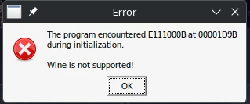

### GE-Proton is recommended for compatibility issues with webview2. You should also install dotnetdesktop8 to your prefix.

# Garden warfare 1
### 1. Install the game
* Install the game from ea app, launch it once

### 2. Download the latest release
Download the archive from [the releases](https://github.com/PvZ-Cypress/Cypress/releases) tab, launch the .exe in the same prefix > go to patcher and press apply patch

### 3. Configure dlloverrides
```
WINEDLLOVERRIDES="dinput8=n,b" %command%
```

Open up winetricks > select gw1's pfx > select winecfg > go to libraries > add the following

```
dinput8
```

- Launch via the launcher

# Garden warfare 2/Battle for Neighborville
### 1. Install the game
* Install the game from your platform, launch it once
* If prompted about the anti-cheat, select `Yes`
* You should receive an error message like `wine not supported` - click OK



### 2. Downgrade your game
Download the archive from [the releases](https://github.com/PvZ-Cypress/Cypress/releases) tab, launch it > go to patcher and press apply patch

### 3. Install the mods in the right order
Use [this frosty mod manager](https://www.nexusmods.com/masseffectandromeda/mods/1190?tab=files&file_id=6904) instead of the stock one as the stock one doesn't work with wine.

### 4. Configure dlloverrides
Add the following launch option in Steam:
```
WINEDLLOVERRIDES="dinput8=n,b;winmm=n,b" %command% -dataPath ModData/Default
```

Open up protontricks > select gw2/bfn > select winecfg > go to libraries > add the following

```
dinput8
winmm
```

### 5. Launch the game
- Launch via the launcher if you own the game on EA App. If you own the game on steam just pass in the launch args yourself;

### Arguments
`-name`

`-dataPath`

`-Client.ServerIp`

`-Server.ServerPassword`

`CYPRESS_IDENTITY_JWT`

`CYPRESS_LOG_LEVEL`

### Disclaimer about machines with low ram

If your frosty crashes due to oom when installing large mods run this;
```
systemctl disable --now systemd-oomd
systemctl stop --now systemd-oomd
systemctl mask systemd-oomd
```

# Hosting as dedicated server
See [this](./LINUX_DEDICATED.md)
